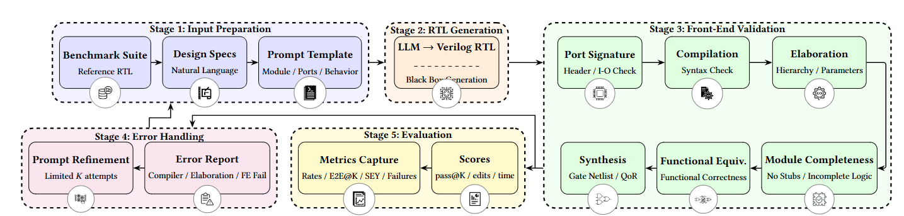

# LLM-Based RTL Evaluation Framework- A stage-based evaluation pipeline for assessing Verilog RTL generated by Large Language Models (LLMs).

As hardware design productivity struggles to keep pace with increasing system complexity, this framework systematically evaluates whether LLMs can reliably generate synthesizable, functionally correct hardware code. Through 6 validation stages (Port Signature → Compile → Elaboration → Module Completeness → Functional Equivalence → Synthesis), automatic prompt refinement with K-attempt budget, and comprehensive metrics including E2E@K, SEY@K, ETS, and TTFP, the tool provides researchers and engineers with quantitative insights into LLM capabilities and limitations for hardware design automation.



## Validation Stages

| Stage | Name | What it checks | Tool |
|-------|------|----------------|------|
| P | Port Signature | Module header, port declarations, I/O direction | Python + Yosys |
| C | Compilation | Syntax errors, Verilog legality | Icarus Verilog |
| E | Elaboration | Module hierarchy, parameters | Yosys |
| M | Module Completeness | No stubs, no placeholders, complete logic | Python |
| F | Functional Equivalence | Matches reference implementation | Yosys |
| S | Synthesis | Gate-level netlist generation | Cadence Genus |

## Design Naming Convention

The framework uses a single `DESIGN` variable to control all file paths. When you set:
DESIGN = "half_adder"

All paths are automatically derived:

| Path Variable | Actual Path |
|---------------|-------------|
| PROMPT_FILE | prompts/half_adder.txt |
| RTL_FILE | rtl/half_adder.v |
| RAW_FILE | rtl/raw_output.txt |
| REFERENCE_PATH` | reference/half_adder/ |
| RESULT_DIR | results/half_adder/ |

## Directory Structure
```
llm_rtl_project/
├── main.py # Core RTL generation script
├── run_all.py # Batch testing orchestrator
├── metrics.py # Metrics calculator
├── prompts/ # Input prompts (you create)
│ └── {design}.txt
├── reference/ # Golden reference designs (you provide)
│ └── {design}/ # Directory with .v files
│ └── *.v
├── rtl/ # Generated output (auto-created)
│ ├── {design}.v   #extracted verilog code LLM output
│ └── raw_output.txt  #raw output generated by LLM
├── results/ # Per-design results (auto-created)
│ └── {design}/
│ ├── area.rpt  #Genus area report
│ ├── timing.rpt  #Genus timing report
│ ├── power.rpt  #Genus power report
│ ├── S.log  #Synthesis stage log - contains the complete output from running Cadence Genus on the remote server. 
│ ├── F_yosys.log # 	Formal equivalence check log - contains Yosys output when comparing generated RTL against reference implementation. Shows whether designs are functionally equivalent.
│ └── result.json # Detailed JSON results for a the corresponding design - contains all stage results (P, C, E, M, F, S)
├── results.csv # Aggregated results
└── metrics_report.txt # Formatted metrics output
```


## Software Requirements

### Required Tools

| Software | Version | Installation |
|----------|---------|--------------|
| Python | 3.8+ | `sudo apt install python3` |
| Icarus Verilog | 10.0+ | `sudo apt install iverilog` |
| Yosys | 0.9+ | `sudo apt install yosys` |
| sshpass | Latest | `sudo apt install sshpass` |
| pip3 | Latest | `sudo apt install python3-pip` |

### Python Dependencies

```
pip3 install requests
```

### Remote Server (for S-stage Synthesis)

| Software | Description |
|----------|-------------|
| Cadence Genus | Synthesis tool for gate-level netlist generation |
| Technology Library | `.lib` files for target process |

**Note:** The S-stage (Synthesis) requires access to a remote server with Cadence Genus installed. You can modify the `genus_script` in `main.py` to use your synthesis tool.

## How to Use

### 1. Installation
##### Clone or create the project directory
##### Install required system tools
##### Install Python dependencies

### 2. Configure the Tool
#### Edit the following in main.py
```
# =====================================
# DESIGN NAME
# =====================================
DESIGN = "half_adder" #name of the initial design in the run; will be automatically updated from the next design onwards listed in the DESIGN dictionary in run_all.py

# =====================================
# LLM PROVIDER
# =====================================
LLM_PROVIDER = "ollama"  # Options: ollama, openai, huggingface, anthropic, gemini, deepseek

# =====================================
# OLLAMA (Local)
# =====================================
OLLAMA_HOST = "MENTION YOUR LOCAL HOST HTTP ADDRESS"
OLLAMA_MODEL = "MENTION_YOUR MODEL OF PREFERENCE" # ensure that Ollama is configured in your local system and the model of preference is pulled

# =====================================
# OPENAI (Cloud)
# =====================================
OPENAI_API_KEY = os.environ.get("OPENAI_API_KEY", "your-openai-api-key")
OPENAI_MODEL = "MENTION_YOUR MODEL OF PREFERENCE" 

# =====================================
# ANTHROPIC (Cloud)
# =====================================
ANTHROPIC_API_KEY = os.environ.get("ANTHROPIC_API_KEY", "your-anthropic-api-key")
ANTHROPIC_MODEL = "MENTION_YOUR MODEL OF PREFERENCE" 

# =====================================
# GEMINI (Cloud)
# =====================================
GEMINI_API_KEY = os.environ.get("GEMINI_API_KEY", "your-gemini-api-key")
GEMINI_MODEL = "MENTION_YOUR MODEL OF PREFERENCE"

# =====================================
# DEEPSEEK (Cloud)
# =====================================
DEEPSEEK_API_KEY = os.environ.get("DEEPSEEK_API_KEY", "your-deepseek-api-key")
DEEPSEEK_MODEL = "MENTION_YOUR MODEL OF PREFERENCE"

# =====================================
# HUGGINGFACE (Cloud)
# =====================================
HF_API_KEY = os.environ.get("HF_API_KEY", "your-huggingface-token")
HF_MODEL = "MENTION_YOUR MODEL OF PREFERENCE"

# =====================================
# REMOTE SYNTHESIS (S-stage - Optional)
# =====================================
REMOTE_USER = "your_username"
REMOTE_HOST = "your-server.com"
REMOTE_DIR = f"MENTION_YOUR REMOTE DIRECTORY"
SSH_PASS = "your_password"

# =====================================
# REFERENCE TOP MODULE (For multi-file references)
# =====================================
REFERENCE_TOP_NAME = None  # Set if reference top module has different name from the one generated by the LLM
```
#### Edit the following in run_all.py
```
=====================================
DESIGNS TO TEST
=====================================
DESIGNS = ["half_adder", "priority_encoder", "ripple_carry_adder"]

# =====================================
# REFINEMENT BUDGET
# =====================================
K = 3  # Max attempts per design

# =====================================
# INTERACTIVE MODE
# =====================================
INTERACTIVE_MODE = True  # Set to False to run without interactive mode

```
### 3. Run the Tool

Step 1: Run the test suite
```python3 run_all.py```

Step 2: Manually generate metrics report
```python3 metrics.py```

## Metrics Calculated

### Stage-wise Pass Rates 
| Metric | Description |
|--------|-------------|
| PPS | Port Signature pass rate |
| CR | Compile pass rate |
| ER | Elaboration pass rate |
| MC | Module Completeness pass rate |
| FE | Functional Equivalence pass rate |

### Conditional Yields 

| Metric | Description |
|--------|-------------|
| CR \| PPS | Compile rate given Port Signature pass |
| ER \| CR | Elaboration rate given Compile pass |
| MC \| ER | Module Complete rate given Elaboration pass |
| FE \| MC | Functional Equivalence rate given Module Complete |

### Bounded Refinement

| Metric | Description |
|--------|-------------|
| E2E@K | End-to-end success within K attempts |

### Failure Breakdown

| Metric | Description |
|--------|-------------|
| First-failure stage | Where design first fails (P, C, E, M, F, S, or None) |
| Root cause | compiler, not-elaborated, partial_module, functional_mismatch, other |

### Synthesis-Eligible Yield

| Metric | Description |
|--------|-------------|
| SEY@K | Synthesis-eligible yield within K attempts |

### Auxiliary Metrics 

| Metric | Description |
|--------|-------------|
| E2E@1 | One-shot end-to-end rate |
| ETS | Edits to Success (avg refinements before success) |
| TTFP | Time to First Pass (avg seconds to success) |
